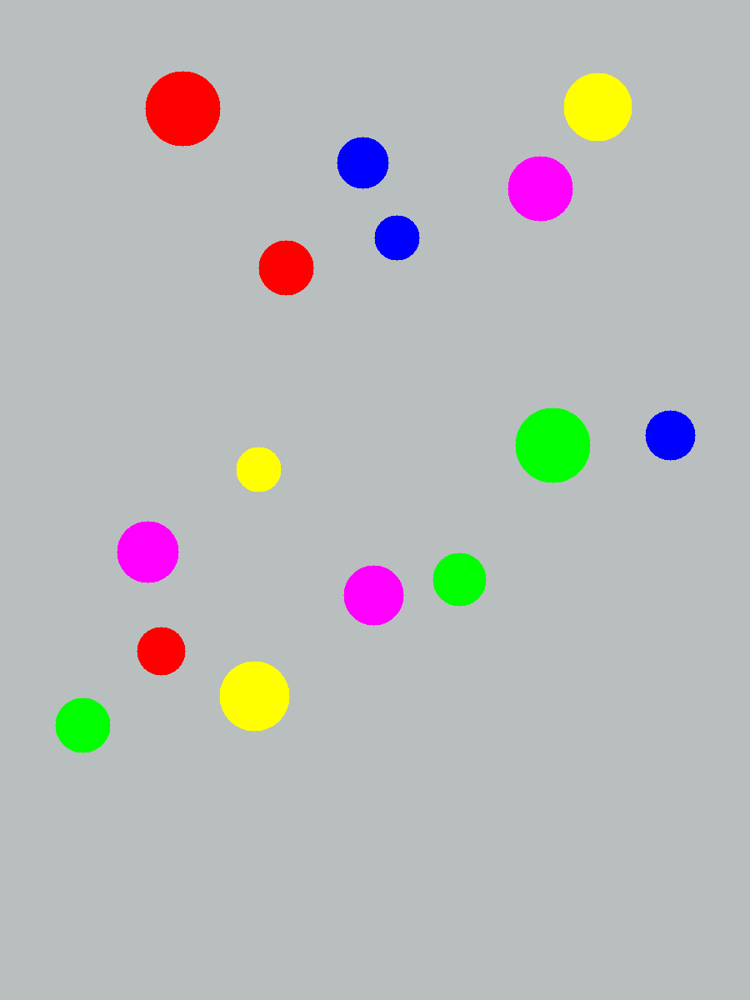
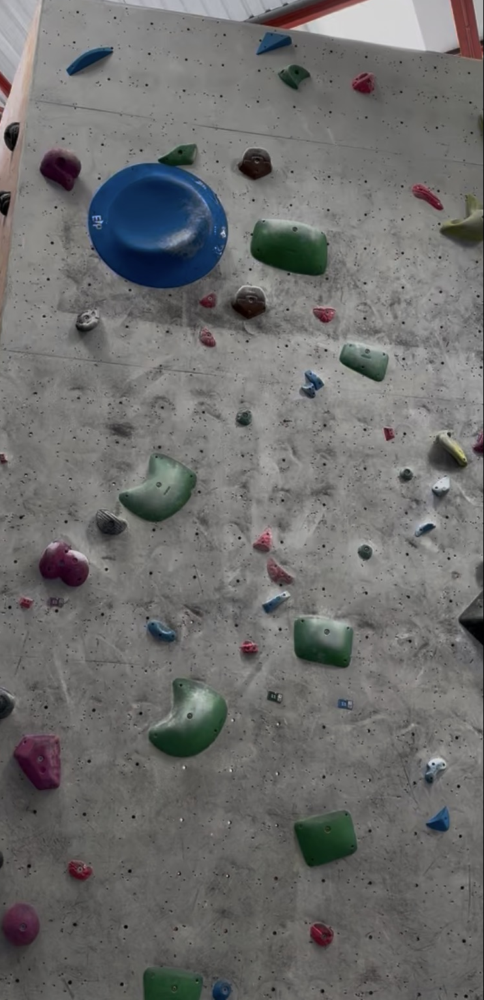
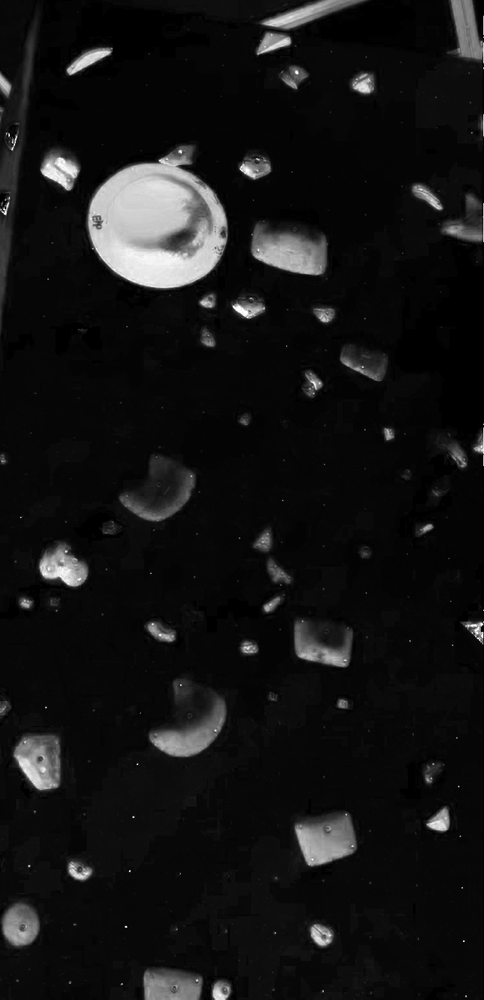
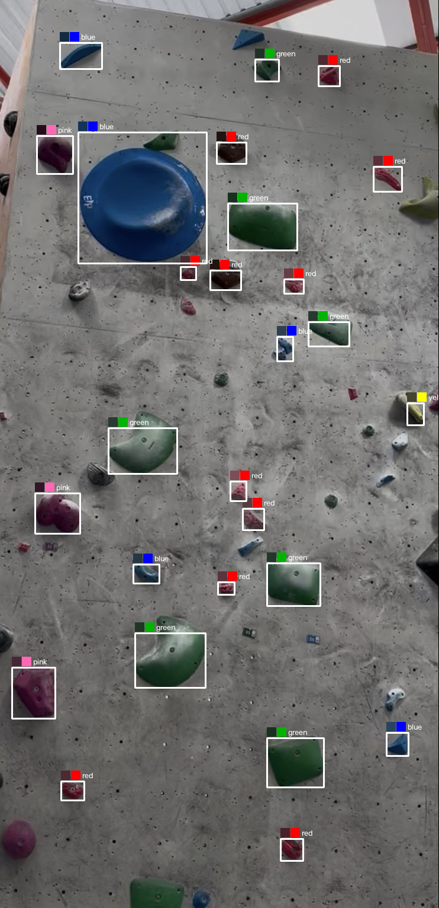
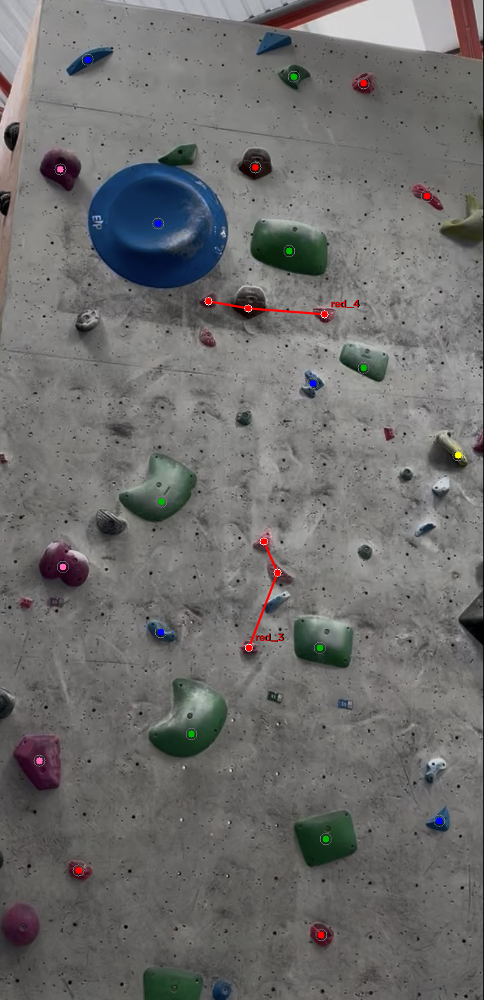
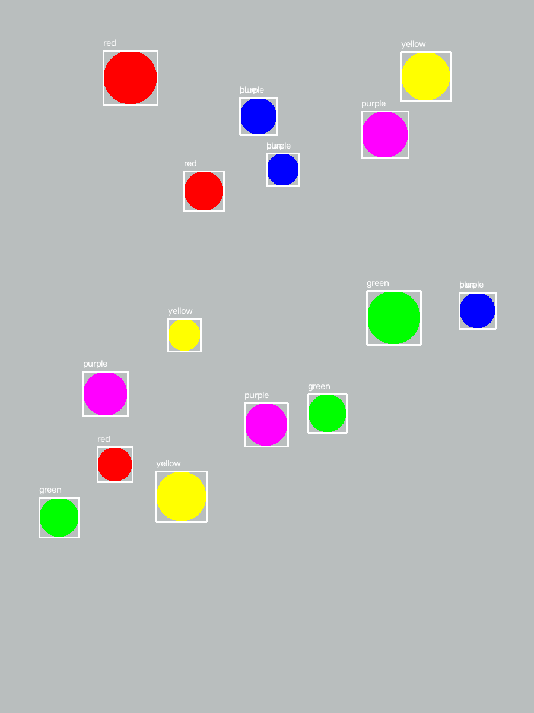

# Bouldering Route Topo Mapper

A traditional computer vision pipeline (OpenCV + NumPy, **no deep learning**) that takes a
photo of an indoor bouldering wall and attempts to detect individual climbing holds,
classify each hold's color, and group holds into candidate routes.

Built incrementally as a portfolio project, with every milestone tested and debugged
against real data rather than assumed to work. That process — including the parts that
didn't work — is documented below, not hidden.

## Problem definition

Given a single photo of a bouldering wall, produce:

1. A list of detected hold locations (bounding box + centroid)
2. A color label for each detected hold
3. Candidate groupings of holds into routes

## Motivation

Indoor gyms mark routes with colored holds and/or tape; manually cataloguing routes
("topo mapping") from a photo is tedious. This project explores how far purely classical
image-processing techniques — no training data, no GPU, $0 cost — can get toward
automating that, and is honest about where that approach breaks down.

## Example input/output

**Inputs** — a controlled synthetic baseline, and a real gym wall photo:


*`generate_synthetic_wall.py` output: 15 solid-colored circles, flat background, fixed random seed.*


*`data/raw/crop_v1.png` — real lighting, wall texture, shadows, unknown hold colors.*

**Outputs** — detection, color classification, and route grouping on the real photo:


*The HSV saturation channel: holds are visibly brighter than the gray wall — the cue detection is built on.*


*27 holds detected without knowing any colors in advance, then each one classified by its actual sampled color.*


*Color + spatial clustering: only two small 3-hold groups (red_3, red_4) survive as plausible route segments — see "Failed approaches" below for why.*


*The Milestone 1 synthetic baseline: 15/15 holds correctly detected and color-labeled.*

## Architecture

```
scripts/
  generate_synthetic_wall.py  - Milestone 1: controlled synthetic test image + ground truth JSON
  detect_holds.py             - Milestone 1: multi-color HSV detection on the synthetic image
  hold_detection.py           - shared color-agnostic detection pipeline (saturation
                                 threshold -> morphology -> contours -> border filter)
  detect_holds_generic.py     - Milestone 2: detection entry point, dumps every pipeline
                                 stage to disk for visual debugging
  classify_hold_colors.py     - Milestone 3: per-hold color classification
  group_routes.py             - Milestone 4: color grouping + MST-based spatial clustering
  annotate_points.py          - manual click-to-annotate tool for ground-truth/feedback

data/
  raw/        - tracked source inputs (real photos); generated images are gitignored
  processed/  - all generated outputs (gitignored, fully reproducible by rerunning scripts)

docs/images/  - a handful of curated result screenshots, committed specifically for this README
```

`hold_detection.py` was extracted out of `detect_holds_generic.py` once a *second* script
(`classify_hold_colors.py`) needed the exact same detection logic — identical code that had
to stay in sync, not just similar code. Before that point the project deliberately stayed
flat (no `src/` package), per a "smallest sensible architecture first" approach.

## How it works

### 1. Synthetic baseline

`generate_synthetic_wall.py` draws 15 solid-colored circles (3 each of red/yellow/green/
blue/purple, fixed random seed) on a flat gray background, and saves ground truth (exact
color/position/radius) alongside it — free ground truth, since we placed the holds
ourselves. `detect_holds.py` thresholds each of the 5 known HSV ranges (correctly OR-ing
two ranges for red, which wraps around hue 0) and validates detected counts against that
ground truth: **15/15 correct**.

This baseline deliberately fuses detection and classification into one step (a hold is
found *because* its color matched a known range) — a hypothesis that only works because
the 5 colors were hardcoded in advance. It does not generalize to a real photo.

### 2. Color-agnostic detection (real photos)

`hold_detection.py` detects holds **without knowing their colors**, on the hypothesis that
plastic holds are more saturated than the gray wall:

1. Convert to HSV, isolate the saturation channel.
2. Threshold it (see "Failed approaches" — Otsu's automatic threshold was tested and
   rejected as too conservative; a manually tuned fixed value is used instead).
3. Morphological opening (remove small noise — drilled texture holes, chalk flecks) then
   closing (fill small gaps inside a hold's blob from shadows/highlights).
4. Find contours, filter by minimum area.
5. Drop any blob touching the image border — it's either background bleeding in from
   outside the wall, or a real hold truncated by the crop; either way it can't be fully
   characterized.

### 3. Color classification

`classify_hold_colors.py` samples the HSV pixels inside each detected hold's mask, takes
the **per-channel median** (robust to shadows/highlights/bolt-hole shadows skewing a mean),
and maps the result to a color name via a hue-range lookup table with achromatic overrides
for black/white/gray (hue is meaningless at very low saturation or near-zero brightness).

### 4. Route grouping

`group_routes.py` first tests the baseline hypothesis "same color = same route" (just a
`groupby`), then adds spatial coherence via **single-linkage clustering**, implemented by
building a minimum spanning tree (MST) per color group and cutting any edge longer than a
distance threshold — the remaining connected pieces are spatially-coherent sub-clusters.
No new clustering library needed; the MST already provides it.

### 5. Manual annotation tool

`annotate_points.py` is a click-to-mark tool (left-click to add a point, right-click to
remove, `s` to save) used to collect ground truth / feedback on real photos, where unlike
the synthetic wall we don't get it for free. Saves exact pixel coordinates (comparable
directly against detection output) plus a preview image.

## Installation

Requires **Python 3.13+**. (The original `numpy==1.26.4` pin predates official 3.13
wheels — pip silently substituted a broken experimental MinGW build that segfaulted on
import. Pins in `requirements.txt` are now versions confirmed to have proper 3.13 wheels.)

```powershell
git clone <repo-url>
cd bouldering-route-topo-mapper
pip install -r requirements.txt
```

## Usage

Run from the repo root, in this order:

```powershell
# Synthetic baseline (self-contained -- generates its own test image)
python scripts/generate_synthetic_wall.py
python scripts/detect_holds.py

# Real-photo pipeline (uses the tracked data/raw/crop_v1.png)
python scripts/detect_holds_generic.py
python scripts/classify_hold_colors.py
python scripts/group_routes.py

# Optional: annotate a photo manually (e.g. to mark holds a run missed)
python scripts/annotate_points.py <image_path> <output_json_path>
```

Every script prints a summary to the console and writes outputs to `data/processed/`
(gitignored — fully reproducible by rerunning).

## Configuration

All tuning is via plain module-level constants (no CLI flags yet — scope is still
single-photo exploration):

| File | Constant | Controls |
|---|---|---|
| `hold_detection.py` | `SATURATION_THRESHOLD` | Cutoff separating "hold" from "wall" |
| `hold_detection.py` | `MIN_CONTOUR_AREA` | Minimum blob size kept as a hold |
| `hold_detection.py` | `OPEN_KERNEL_SIZE` / `CLOSE_KERNEL_SIZE` | Morphology kernel sizes |
| `classify_hold_colors.py` | `HUE_RANGES`, `BLACK_VALUE_MAX`, `GRAY_SATURATION_MAX` | Color-name bucket boundaries |
| `group_routes.py` | `SPATIAL_LINK_THRESHOLD` | Max pixel distance for two same-color holds to count as one route |

## Evaluation methodology

Honest state: only the **synthetic baseline** has a formal, free ground truth (every hold's
exact color/position is known because we placed it) and gets an automated count-match
check. The **real photo** has no formal ground truth — `annotate_points.py` was used to
manually mark 16 additional holds the detector missed, which let us classify *why* each was
missed (see Results), but this is a one-off manual spot-check, not an automated precision/
recall pipeline. Building that properly is listed under Future Improvements.

## Results

**Synthetic baseline:** 15/15 holds detected and correctly color-labeled.

**Real photo** (`crop_v1.png`, a 742×1532px crop of an indoor gym wall):
- 27 holds detected via color-agnostic saturation thresholding.
- Of those 27, every one checked by hand was a real hold — **zero confirmed false
  positives** at the final settings.
- 16 additional real holds were manually identified as missed, breaking down as:
  - 6 holds whose saturation genuinely never clears the threshold (gray/white/brown)
  - 5 holds below the minimum blob area (recoverable, but only by reintroducing false
    positives — see Failed Approaches)
  - 6 holds dropped by the border filter (sit very close to the frame edge)
  (some holds fall in more than one category)
- Rough recall estimate: 27 of ~43 known real holds found, **≈63%**, with no confirmed
  false positives in this sample.

**Color classification:** all 27 holds labeled (red 11, green 7, blue 5, pink 3, yellow 1)
after a bug fix (see below).

**Route grouping:** the "same color = route" baseline was tested and falsified. Adding
spatial clustering found only 2 plausible 3-hold route fragments; 21 of 27 holds had no
same-colored neighbor within clustering range at all.

## Known limitations

- **Low-saturation holds are a blind spot.** Gray/white/brown holds can be nearly as
  desaturated as the concrete wall; saturation-based detection structurally cannot find
  them. Would need a different or additional cue (texture, local contrast).
- **Border filter trade-off.** Rejecting blobs that touch the image edge correctly removes
  background objects (ceiling structure, wall trim) but also discards real holds sitting
  very close to the frame boundary. No way to distinguish the two cases with this cue alone.
- **Real precision/recall tension on small holds.** Lowering the minimum blob area recovers
  some real small holds but also reintroduces false positives (tape/number tags, wood
  grain texture) — not a free parameter to tune away.
- **Hue circularity not handled.** Hue wraps at 0/179; a plain per-channel median can
  misbehave for colors straddling that boundary (red). Not fixed, just documented.
- **Color naming doesn't distinguish tint/shade from hue family.** A dark saturated
  magenta/maroon hold and a pastel pink currently get the same name ("pink").
- **`SPATIAL_LINK_THRESHOLD` is photo-specific**, tied to this camera's distance from the
  wall. Won't transfer to a different photo without re-tuning.
- **No formal evaluation pipeline** for real photos (see Evaluation methodology above).

## Failed approaches / experiments

These are kept here deliberately — they're as informative as what worked.

- **Stage 0, single hardcoded HSV range for "red"** (since removed from the repo; see git
  history). Its own code comment claimed it was tuned for "this synthetic test image" —
  but it was run against the real photo, where the background steel roof trusses happened
  to fall in the same red HSV range. Result: 0 true positives, 9 false positives, all on
  the ceiling. Root cause: an untested assumption baked into a comment. Lesson: always
  validate against the actual target data, not what you assume about it.
- **Otsu's automatic thresholding** on the saturation channel picked 84, which was
  measurably too conservative — it missed 9 real holds that a manually tuned threshold of
  45 recovered, for only 4 new noise blobs. Verified by directly comparing what each
  threshold added/removed (contact-sheet crops of the differences), not by guessing.
- **Lowering `MIN_CONTOUR_AREA` to recover small missed holds.** Tested at 150 (from 400):
  recovered ~7 real holds, but also reintroduced a wood-grain texture sliver and — notably
  — a blue numbered tape tag ("11") as a false positive. Rejected as not a clean win;
  documented as a real precision/recall trade-off instead.
- **"Same color = same route."** The most important failed hypothesis in the project.
  Visualizing each color group as a minimum spanning tree showed physically impossible
  routes zigzagging across the entire wall. The real route-identifying signal at this gym
  is most likely the small numbered tape tags visible in the photo, which this project
  does not yet attempt to read.

## Future improvements

- Build a real precision/recall evaluation harness (scoring both the synthetic ground
  truth and manually-annotated real-photo ground truth automatically, not just printing
  counts).
- A secondary detection cue for low-saturation holds — local contrast or texture/edge
  density instead of absolute HSV saturation.
- Adaptive/local thresholding instead of one global saturation cutoff, to handle unequal
  lighting across a single photo.
- Investigate detecting the numbered tape tags directly as the real route-identifying
  signal, rather than relying on hold color/proximity.
- Test on a second wall photo (different lighting/gym) to separate what's genuinely
  general from what's tuned to this one photo.
- Proper circular statistics for hue (handle the red wraparound correctly).

## Technical decisions

- **Traditional CV only** (HSV thresholding, morphology, contours, MST-based clustering) —
  no deep learning, $0 cost, and the explicit goal was to learn and demonstrate classical
  image-processing fundamentals rather than chase state-of-the-art accuracy.
- **Reproducibility over committing generated files.** The synthetic wall uses a fixed
  random seed; all generated images/JSON (`data/processed/`, the synthetic wall image)
  are gitignored rather than committed, since they're always reproducible by rerunning the
  relevant script. Only source inputs (real photos) and code are tracked.
- **Shared code extracted only when truly needed.** `hold_detection.py` was split out only
  once a second script needed byte-identical logic — not at the first sign of similarity.
- **Parameters tuned via controlled experiments**, not guesses — e.g. the saturation
  threshold and area-threshold decisions were each based on directly inspecting what a
  change added or removed, not intuition.

## Known-good environment

- Python 3.13
- `opencv-python==5.0.0.93`, `numpy==2.5.3`, `matplotlib==3.11.2` (see `requirements.txt`)
